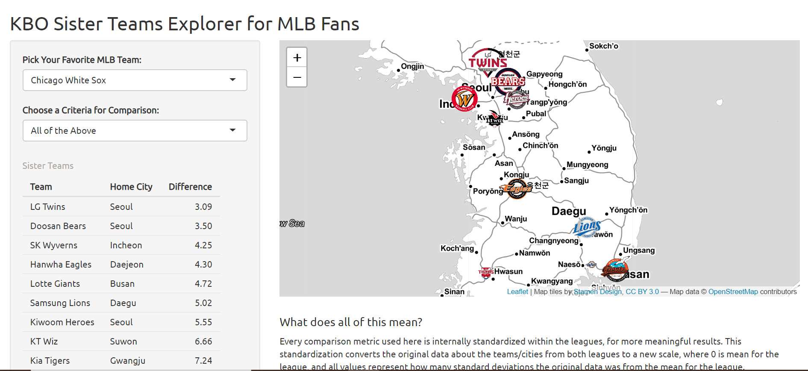
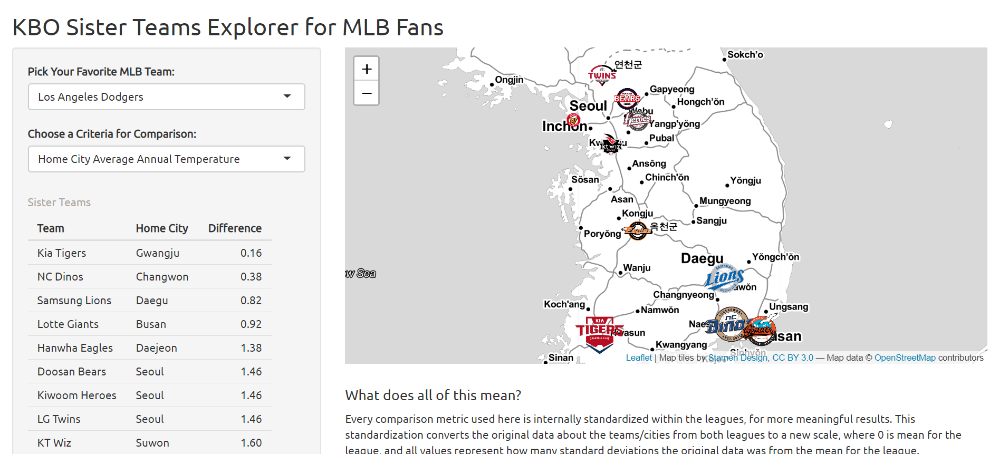

# Sister Teams Explorer

## Overview

With most of the United States under some level of lockdown and the Major League Baseball (MLB) season completely stalled out due to the COVID-19 pandemic and owner/player disputes, many American baseball fans are turning to Korean Baseball Organization (KBO) games in South Korea for some much needed entertainment. KBO games have been airing live on ESPN since late April, and will continue to air for at least the rest of the 2020 season. While many American fans are content to pick a team to support at near random or just casually follow the league as a whole, this project was designed for people who are still looking for a team to support but don't know how to choose. 

The code here is for an RShiny app, hosted [here](https://isaacrand.shinyapps.io/Sister-Teams-Explorer/), which would allow users to pick a KBO team to support based on similarity to an MLB team which they already cheer for.

## Goals & Objectives

 The general layout should require the user to choose their favorite MLB team and some metric by which to compare them for similarity to other teams. They should be able to choose from some sports specific measurements (like historic win percentage, total championship wins, etc.) as well as some city specific measurements (like population, average temperature, etc.). This will allow users to choose their new KBO team based on what they found important about their old MLB team.

 I think that most people are originally tied to a baseball team by geography; the team from their city usually becomes their favorite team. Because of this, I would like to allow people to compare their own cities to the cities of South Korea for similarity. Additionally, I think that people become attached to what they see as the personality of their own team, often tied up in historic winning levels or length of team history, so I would like to allow people to compare some metrics of the teams as well. 
 	
  The app will appear with some textual input and output on the left, and a map output of South Korea on the right. The input consists of two drop down menus, allowing users to select their favorite team and the metric they want to use to compare for similarity. Once selected, the text output of all 10 KBO teams in order of similarity would appear on the bottom left. The right side of the application will be a map of South Korea, with all 10 teams mapped. Each team will be represented in their home city by an image of their logo, sized relative to its similarity to the user’s input favorite team (bigger for more similar teams, smaller for less). 

## Data Description

### Data Collection

This project will rely on several data sources representing cities in three different countries: South Korea, the United States, and Canada. In an attempt to maintain consistency of measurement accuracy across cities and countries, the data about each city (population, GDP, temperature) will come from global rasters of that data. Those rasters will be spatially subset by the boundaries of each city in R, in order to get city level data. Administrative boundary data on South Korean Cities will come from the Database of Global Administrative Areas. The boundary data on US Cities comes from the US Center for Disease Control and Prevention. Finally, the boundary data for Toronto (the one Canadian city with representation in the MLB) comes from the city’s website. Data about each team’s history comes from sources individual to each league. 

Information on the data used here (sources, spatial and temporal resolution, definition) is included below. Full sources with clickable links are at the end of the readme.

### Data Standardization

Every comparison metric used here will be internally standardized within the leagues, for more meaningful results. This standardization converts the original data from both leagues to a new scale, where 0 is mean for the league, and all values represent how many standard deviations the original data was from the mean for the league. For more on standardization, click [here](https://www.statisticshowto.com/standardized-variables/#:~:text=In%20statistics%2C%20standardized%20variables%20are,were%20measured%20on%20different%20scales.). 
 
The question which the app is designed to answer is "who is the mlb team x of the kbo?." So, instead of just comparing, for example, the year an MLB team was founded to the year a KBO team was founded, the standardization of the data means we are comparing how old an MLB team is for an MLB team to how old a KBO team is for a KBO team. This is important. The oldest KBO team was founded in 1982, whereas some MLB teams go all the way back to the late 1800s. If raw numbers were compared, even the oldest KBO teams would be most similar to relatively new MLB teams. By comparing standardized data, the teams which are oldest for the league they are in are the most similar. The same is principle is true for the other variables (the city's which have the highest/lowest/most average characteristics for the US are most similar to the city's in Korea which have the highest/lowest/most average characteristics).

## Current State of the Project

The app as it stands [here](https://isaacrand.shinyapps.io/Sister-Teams-Explorer/) allows users to select one MLB team and one comparison criteria at a time and see what KBO teams are most similar to it using that criteria. The results are output as a table and as a map. The table shows all the KBO teams, their home city, and a field called `Difference`. `Difference` is the absolute value of the difference between the standardized value of the comparison criteria for the MLB team/city selected and the standardized value of the comparison criteria for each KBO team/city. The map output shows each team represented by a point which is shown by its team logo, as found [here](https://forums.ootpdevelopments.com/showthread.php?t=277508), and sized in inverse proportion to the team's `Difference`.

When "All the Above" is chosen as the comparison criteria, the `Difference` field is equal to the sum of the `Difference` field  as calculated for all of the other comparison criteria.

In addition, clicking on a team's icon launches a popup which allows you to navigate to wikipedia sites for the team or the team's city.

## Future Work?

There are a few paths this project could be expanded along. The first is that, if there was interest among long time Korean fans (which I truly do not know if there is), a tab could be added which does the same thing but in reverse, allowing users to input a KBO team see what MLB teams are most similar. Additionally, if more data was collected, the same principles could be applied to other sports leagues around the world without too much changing around. There is not even any data collected here which is specific to baseball, so the same principle could theoretically allow you to compare MLB teams to team in the Dominican Winter League of baseball just as easily as the Premier League of Soccer.

It could also be interesting to add more comparison criteria (like winning percentage maybe?) or a more meaningful way to combine comparison criteria than "All the Above." This could maybe take the form of some sliders allowing users to determine how much they want to weight specific criteria.

Without adding any additional data, the app could also be improved by adding more links to learn about each team than their wikipedia sites. At present, the state of the english language information for KBO fans is not super broad. However, mykbostats.com provides updating english language information about the league daily. Their terms of use prevents access from web crawlers, but something similar could possibly be added to the app in the future.

## Authorship Details

This project was written as my final project for Geographic Information Sciences 3 at the University of Chicago #RollRoons.

I am a second year in the college right now, working towards a degree in Geographical Sciences. I personally am a big believer that the NC Dinos should be America's KBO team, and am not so secretly devastated that my results did not confirm that they are the Chicago White Sox, Chicago Cubs, or Philadelphia Phillies of the KBO. I'm not letting that shake me though #WeAreNC. 

## Full Data Source Citations

### Attribute Data
MLB Team Age & Home City Name:
Baseball Almanac. “Major League Baseball Team Histories.” Accessed May 20, 2020. [https://www.baseball-almanac.com/teammenu.shtml](https://www.baseball-almanac.com/teammenu.shtml).

MLB Team Number of Championships:
Major League Baseball. “World Series Overview.” Accessed May 20, 2020. [http://mlb.mlb.com/mlb/history/postseason/mlb_ws.jsp?feature=club_champs](http://mlb.mlb.com/mlb/history/postseason/mlb_ws.jsp?feature=club_champs).   

KBO Team Age & Number of Championships & Home City Name:
Tracy, Jeff. “Getting to Know the Korea Baseball Organization.” Axios, May 6, 2020. [https://www.axios.com/korea-baseball-organization-kbo-rules-teams-history-c3db7ddd-0d2b-44cf-a9b0-24bc9cfa6502.html]([https://www.axios.com/korea-baseball-organization-kbo-rules-teams-history-c3db7ddd-0d2b-44cf-a9b0-24bc9cfa6502.html)

### Spatial Data

#### Rasters
Population:
Center for International Earth Science Information Network - CIESIN - Columbia University. 2018. Gridded Population of the World, Version 4 (GPWv4): Population Count, Revision 11. Palisades, NY: NASA Socioeconomic Data and Applications Center (SEDAC). [https://doi.org/10.7927/H4JW8BX5](https://doi.org/10.7927/H4JW8BX5). Accessed May 20, 2020

Annual Mean Temperature:
WorldClim.org. “Hisotrical Climate Data,” 2020. [https://www.worldclim.org/data/worldclim21.html](https://www.worldclim.org/data/worldclim21.html).

GDP:
Peduzzi, Pascal. “Gross Demestic Product.” Global Risk Data Platform, June 28, 2012. [https://preview.grid.unep.ch/index.php?preview=data&events=socec&evcat=1&lang=eng](https://preview.grid.unep.ch/index.php?preview=data&events=socec&evcat=1&lang=eng).

#### City Boundaries

US Cities' Boundaries:
Center for Disease Control and Prevention. “500 Cities: City Boundaries.” Data.gov, February 26, 2020. [https://catalog.data.gov/dataset/500-cities-city-boundaries-acd62](https://catalog.data.gov/dataset/500-cities-city-boundaries-acd62).

Toronto's Boundaries:
City of Toronto. (2012, August 31). Regional Municipal Boundary. City of Toronto Open Data Portal. https://open.toronto.ca/dataset/

Korean Cities' Boundaries:
GADM.org. “GADM Data,” 2018. [https://gadm.org/data.html](https://gadm.org/data.html).
